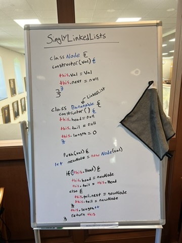
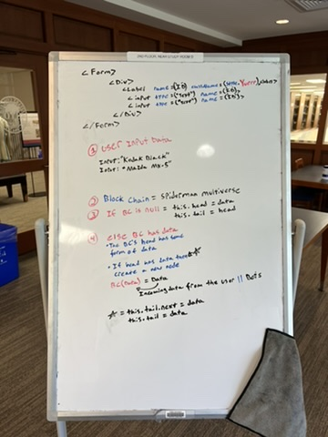
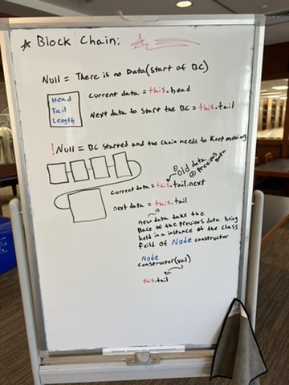

# SpiderMan-Multiverse-Linked-List

# Exploring the Multiverse of Spider-Men: A Linear Data Structure Adventure

In this exploration, we're going to delve into the Multiverse of Spider-Men using a linear data structure known as a linked list. But fear not, fellow web-slingers and data enthusiasts, for this adventure shall be as exhilarating as swinging through the skyscrapers of New York City!

## Visualizing the Multiverse

And now, behold the Multiverse in all its glory!

# Daniel Library - South Carolina

Feel free to explore the depths of the Multiverse with these amazing Spider-Men:

1. 
2. 
3. 
4. 

Now, fellow adventurers, armed with this knowledge, go forth and traverse the Multiverse of Spider-Men with confidence!
